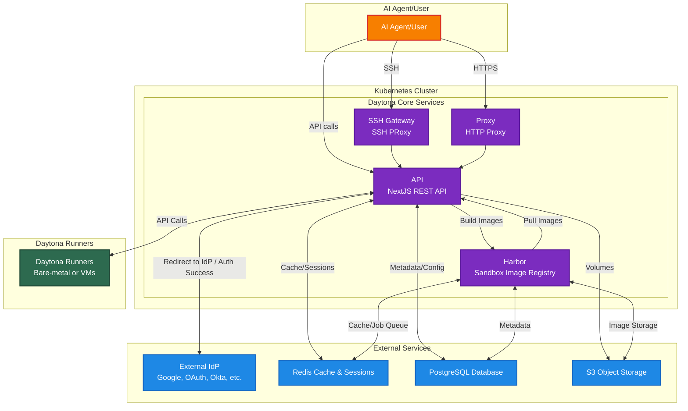

# Daytona Helm Chart

This Helm chart deploys the complete Daytona platform on Kubernetes - a secure infrastructure for running AI code, including all necessary services and dependencies.

## Architecture

The following diagram illustrates the architecture of Daytona Core Services within a Kubernetes Cluster, showing its interactions with users, Daytona Runners, and various supporting services:

**Note:** While the diagram shows supporting services (PostgreSQL, Redis, S3 Storage, IdP) as external components, the Helm chart can deploy these as built-in subcharts within the same Kubernetes cluster. You can choose to use the included subcharts (PostgreSQL, Redis, Dex) or configure the chart to use external services by setting the appropriate values in `values.yaml`. MinIO is disabled by default.



## Prerequisites

- Kubernetes 1.19+
- Helm 3.2.0+

## Installing the Chart

To install the chart with the release name `daytona`:

```bash
helm install daytona ./charts/daytona
```

To install with custom values:

```bash
helm install daytona ./charts/daytona -f my-values.yaml
```

## Uninstalling the Chart

To uninstall/delete the `daytona` deployment:

```bash
helm uninstall daytona
```

## Configuration

The following table lists the configurable parameters and their default values.

### Global Configuration

| Parameter | Description | Default |
|-----------|-------------|---------|
| `global.imageRegistry` | Global image registry override | `""` |
| `global.imagePullSecrets` | Global image pull secrets | `[]` |
| `global.storageClass` | Global storage class | `""` |
| `global.namespace` | Global namespace for all resources | `""` (uses Release.Namespace) |
| `baseDomain` | Base domain for Daytona services | `"daytona.example.com"` |

### API Service Configuration

| Parameter | Description | Default |
|-----------|-------------|---------|
| `services.api.image.registry` | API image registry | `docker.io` |
| `services.api.image.repository` | API image repository | `daytonaio/daytona-api` |
| `services.api.image.tag` | API image tag | `""` (defaults to Chart.AppVersion) |
| `services.api.image.pullPolicy` | API image pull policy | `IfNotPresent` |
| `services.api.service.type` | API service type | `ClusterIP` |
| `services.api.service.port` | API service port | `3000` |
| `services.api.service.annotations` | API service annotations | `{}` |
| `services.api.ingress.enabled` | Enable API ingress | `true` |
| `services.api.ingress.className` | API ingress class | `"nginx"` |
| `services.api.ingress.annotations` | API ingress annotations | `{}` |
| `services.api.ingress.hostname` | API ingress hostname | `""` (defaults to `baseDomain`) |
| `services.api.ingress.path` | API ingress path | `"/"` |
| `services.api.ingress.pathType` | API ingress path type | `"Prefix"` |
| `services.api.ingress.tls` | Enable TLS | `true` |
| `services.api.ingress.selfSigned` | Enable self-signed certificates | `false` |
| `services.api.ingress.secrets` | Custom TLS certificates | `[]` |
| `services.api.ingress.extraHosts` | Additional ingress hosts | `[]` |
| `services.api.ingress.extraPaths` | Additional ingress paths | `[]` |
| `services.api.ingress.extraTls` | Additional TLS configuration | `[]` |
| `services.api.ingress.extraRules` | Additional ingress rules | `[]` |
| `services.api.replicaCount` | API replica count | `1` |
| `services.api.autoscaling.enabled` | Enable Horizontal Pod Autoscaler (HPA) | `false` |
| `services.api.autoscaling.minReplicas` | Minimum number of replicas | `1` |
| `services.api.autoscaling.maxReplicas` | Maximum number of replicas | `10` |
| `services.api.autoscaling.targetCPUUtilizationPercentage` | Target CPU utilization percentage | `80` |
| `services.api.autoscaling.targetMemoryUtilizationPercentage` | Target memory utilization percentage | `""` (disabled) |
| `services.api.autoscaling.metrics` | Custom metrics for autoscaling | `[]` |
| `services.api.autoscaling.behavior` | Scaling behavior configuration | `{}` |
| `services.api.autoscaling.annotations` | HPA annotations | `{}` |
| `services.api.resources` | API resource limits/requests | See values.yaml |
| `services.api.nodeSelector` | API node selector | `{}` |
| `services.api.tolerations` | API tolerations | `[]` |
| `services.api.affinity` | API affinity rules | `{}` |
| `services.api.annotations` | API deployment annotations | `{}` |
| `services.api.podAnnotations` | API pod annotations | `{}` |
| `services.api.serviceAccount.create` | Create API service account | `true` |
| `services.api.serviceAccount.name` | API service account name | `""` |
| `services.api.serviceAccount.annotations` | API service account annotations | `{}` |
| `services.api.env` | API environment variables (key-value pairs) | See values.yaml |
| `services.api.extraEnv` | Extra API environment variables (supports valueFrom) | `[]` |

#### API Environment Variables

The following environment variables can be set in `services.api.env`. Empty values are skipped in the deployment template:

**Application Configuration:**
- `ENVIRONMENT`: Application environment | `"production"`
- `PORT`: API port | `"3000"`

**OIDC Configuration:**
- `OIDC_CLIENT_ID`: OIDC client ID | `""` (auto-generated from Dex if empty)
- `OIDC_ISSUER_BASE_URL`: OIDC issuer URL (auto-generated as `https://{{baseDomain}}/idp` if empty)
- `PUBLIC_OIDC_DOMAIN`: Public OIDC domain (auto-generated as `https://{{baseDomain}}/idp` if empty)
- `OIDC_AUDIENCE`: OIDC audience | `""`
- `SKIP_USER_EMAIL_VERIFICATION`: Skip user email verification | `"false"`

**Dashboard Configuration:**
- `DASHBOARD_URL`: Dashboard URL (auto-generated as `https://{{baseDomain}}/dashboard` if empty)
- `DASHBOARD_BASE_API_URL`: Dashboard base API URL (auto-generated as `https://{{baseDomain}}` if empty)

**Registry Configuration (Harbor):**
When Harbor is enabled, registry URLs and credentials are automatically configured. If using an external registry, disable Harbor and set these values:
- `TRANSIENT_REGISTRY_URL`: Transient registry URL | `""`
- `TRANSIENT_REGISTRY_ADMIN`: Transient registry admin username | `""`
- `TRANSIENT_REGISTRY_PASSWORD`: Transient registry admin password | `""`
- `TRANSIENT_REGISTRY_PROJECT_ID`: Transient registry project ID | `""`
- `INTERNAL_REGISTRY_URL`: Internal registry URL | `""`
- `INTERNAL_REGISTRY_ADMIN`: Internal registry admin username | `""`
- `INTERNAL_REGISTRY_PASSWORD`: Internal registry admin password | `""`
- `INTERNAL_REGISTRY_PROJECT_ID`: Internal registry project ID | `""`

**S3 Configuration (MinIO):**
**Note:** MinIO is disabled by default (`minio.enabled=false`). Currently, Declarative Builder File System Operations and Volumes features are not supported in self-hosted Daytona. If MinIO is enabled, S3 endpoint and credentials are automatically configured. If using external S3 storage, disable MinIO and set these values:
- `S3_ENDPOINT`: S3 endpoint URL | `""`
- `S3_STS_ENDPOINT`: S3 STS endpoint URL | `""`
- `S3_REGION`: S3 region | `""`
- `S3_ACCESS_KEY`: S3 access key | `""`
- `S3_SECRET_KEY`: S3 secret key | `""`
- `S3_DEFAULT_BUCKET`: S3 default bucket | `""`
- `S3_ACCOUNT_ID`: S3 account ID | `""`
- `S3_ROLE_NAME`: S3 role name | `""`


**SMTP Configuration:**
- `SMTP_HOST`: SMTP host | `""`
- `SMTP_PORT`: SMTP port | `""`
- `SMTP_USER`: SMTP username | `""`
- `SMTP_PASSWORD`: SMTP password | `""`
- `SMTP_SECURE`: SMTP secure connection | `""`
- `SMTP_EMAIL_FROM`: SMTP email from address | `""`

**Sandbox Configuration:**
- `DEFAULT_SNAPSHOT`: Default snapshot image | `"daytonaio/sandbox:0.5.0"`

**Database Configuration:**
Database configuration is automatically handled based on `postgresql.enabled`:
- If `postgresql.enabled=true`: Uses internal PostgreSQL subchart
- If `postgresql.enabled=false`: Uses `externalDatabase` configuration

**Redis Configuration:**
Redis configuration is automatically handled based on `redis.enabled`:
- If `redis.enabled=true`: Uses internal Redis subchart
- If `redis.enabled=false`: Uses `externalRedis` configuration

**Horizontal Pod Autoscaler (HPA):**
When `services.api.autoscaling.enabled=true`, the HPA will manage the replica count automatically based on CPU and/or memory utilization. The `replicaCount` value is ignored when HPA is enabled. The HPA supports:
- CPU-based scaling via `targetCPUUtilizationPercentage`
- Memory-based scaling via `targetMemoryUtilizationPercentage`
- Custom metrics via the `metrics` array
- Custom scaling behavior (scale up/down policies) via `behavior`

**Note:** When HPA is enabled, ensure that resource requests are set in `services.api.resources.requests` for accurate scaling decisions.

### Proxy Service Configuration

| Parameter | Description | Default |
|-----------|-------------|---------|
| `services.proxy.image.registry` | Proxy image registry | `docker.io` |
| `services.proxy.image.repository` | Proxy image repository | `daytonaio/daytona-proxy` |
| `services.proxy.image.tag` | Proxy image tag | `""` (defaults to Chart.AppVersion) |
| `services.proxy.image.pullPolicy` | Proxy image pull policy | `IfNotPresent` |
| `services.proxy.service.type` | Proxy service type | `ClusterIP` |
| `services.proxy.service.port` | Proxy service port | `4000` |
| `services.proxy.service.annotations` | Proxy service annotations | `{}` |
| `services.proxy.ingress.enabled` | Enable Proxy ingress | `true` |
| `services.proxy.ingress.className` | Proxy ingress class | `"nginx"` |
| `services.proxy.ingress.annotations` | Proxy ingress annotations | `{}` |
| `services.proxy.ingress.hostname` | Proxy ingress hostname | `""` (ignored - wildcard `*.{{baseDomain}}` is hardcoded) |
| `services.proxy.ingress.path` | Proxy ingress path | `"/"` |
| `services.proxy.ingress.pathType` | Proxy ingress path type | `"Prefix"` |
| `services.proxy.ingress.tls` | Enable TLS | `true` |
| `services.proxy.ingress.selfSigned` | Enable self-signed certificates | `false` |
| `services.proxy.ingress.secrets` | Custom TLS certificates (must include wildcard) | `[]` |
| `services.proxy.ingress.extraHosts` | Additional ingress hosts | `[]` |
| `services.proxy.ingress.extraPaths` | Additional ingress paths | `[]` |
| `services.proxy.ingress.extraTls` | Additional TLS configuration | `[]` |
| `services.proxy.ingress.extraRules` | Additional ingress rules | `[]` |
| `services.proxy.replicaCount` | Proxy replica count | `1` |
| `services.proxy.autoscaling.enabled` | Enable Horizontal Pod Autoscaler (HPA) | `false` |
| `services.proxy.autoscaling.minReplicas` | Minimum number of replicas | `1` |
| `services.proxy.autoscaling.maxReplicas` | Maximum number of replicas | `10` |
| `services.proxy.autoscaling.targetCPUUtilizationPercentage` | Target CPU utilization percentage | `80` |
| `services.proxy.autoscaling.targetMemoryUtilizationPercentage` | Target memory utilization percentage | `""` (disabled) |
| `services.proxy.autoscaling.metrics` | Custom metrics for autoscaling | `[]` |
| `services.proxy.autoscaling.behavior` | Scaling behavior configuration | `{}` |
| `services.proxy.autoscaling.annotations` | HPA annotations | `{}` |
| `services.proxy.resources` | Proxy resource limits/requests | See values.yaml |
| `services.proxy.nodeSelector` | Proxy node selector | `{}` |
| `services.proxy.tolerations` | Proxy tolerations | `[]` |
| `services.proxy.affinity` | Proxy affinity rules | `{}` |
| `services.proxy.annotations` | Proxy deployment annotations | `{}` |
| `services.proxy.podAnnotations` | Proxy pod annotations | `{}` |
| `services.proxy.serviceAccount.create` | Create Proxy service account | `true` |
| `services.proxy.serviceAccount.name` | Proxy service account name | `""` |
| `services.proxy.serviceAccount.annotations` | Proxy service account annotations | `{}` |
| `services.proxy.env` | Proxy environment variables | See values.yaml |

#### Proxy Environment Variables

- `PROXY_PORT`: Proxy port | `""` (defaults to 4000 if not set)
- `PROXY_DOMAIN`: Proxy domain (auto-generated as `proxy.{{baseDomain}}:{{PROXY_PORT}}` if empty)
- `PROXY_API_KEY`: Proxy API key | `"super_secret_key"`
- `PROXY_PROTOCOL`: Proxy protocol | `"http"`
- `OIDC_CLIENT_SECRET`: OIDC client secret | `""`

**Note:** Proxy ingress automatically includes a wildcard host (`*.hostname`) to support unique subdomains per sandbox workspace. Custom TLS certificates must include both the domain and its wildcard in the Subject Alternative Names (SAN).

**Horizontal Pod Autoscaler (HPA):**
When `services.proxy.autoscaling.enabled=true`, the HPA will manage the replica count automatically based on CPU and/or memory utilization. The `replicaCount` value is ignored when HPA is enabled. The HPA supports:
- CPU-based scaling via `targetCPUUtilizationPercentage`
- Memory-based scaling via `targetMemoryUtilizationPercentage`
- Custom metrics via the `metrics` array
- Custom scaling behavior (scale up/down policies) via `behavior`

**Note:** When HPA is enabled, ensure that resource requests are set in `services.proxy.resources.requests` for accurate scaling decisions.

### SSH Gateway Service Configuration

| Parameter | Description | Default |
|-----------|-------------|---------|
| `services.sshGateway.enabled` | Enable SSH Gateway service | `true` |
| `services.sshGateway.image.registry` | SSH Gateway image registry | `docker.io` |
| `services.sshGateway.image.repository` | SSH Gateway image repository | `daytonaio/daytona-ssh-gateway` |
| `services.sshGateway.image.tag` | SSH Gateway image tag | `""` (defaults to Chart.AppVersion) |
| `services.sshGateway.image.pullPolicy` | SSH Gateway image pull policy | `IfNotPresent` |
| `services.sshGateway.service.type` | SSH Gateway service type | `LoadBalancer` |
| `services.sshGateway.service.port` | SSH Gateway service port | `2222` |
| `services.sshGateway.service.annotations` | SSH Gateway service annotations | `{}` |
| `services.sshGateway.replicaCount` | SSH Gateway replica count | `1` |
| `services.sshGateway.resources` | SSH Gateway resource limits/requests | See values.yaml |
| `services.sshGateway.nodeSelector` | SSH Gateway node selector | `{}` |
| `services.sshGateway.tolerations` | SSH Gateway tolerations | `[]` |
| `services.sshGateway.affinity` | SSH Gateway affinity rules | `{}` |
| `services.sshGateway.annotations` | SSH Gateway deployment annotations | `{}` |
| `services.sshGateway.podAnnotations` | SSH Gateway pod annotations | `{}` |
| `services.sshGateway.serviceAccount.create` | Create SSH Gateway service account | `true` |
| `services.sshGateway.serviceAccount.name` | SSH Gateway service account name | `""` |
| `services.sshGateway.serviceAccount.annotations` | SSH Gateway service account annotations | `{}` |
| `services.sshGateway.apiKey` | API key for SSH Gateway authentication | `"supersecretapikey"` |
| `services.sshGateway.sshKeys.privClientSSHKey` | Private client SSH key (base64) | `""` |
| `services.sshGateway.sshKeys.pubClientSSHKey` | Public client SSH key (base64) | `""` |
| `services.sshGateway.sshKeys.privGatewaySSHKey` | Private gateway SSH key (base64) | `""` |
| `services.sshGateway.env` | SSH Gateway environment variables | See values.yaml |

#### SSH Gateway Environment Variables

- `SSH_GATEWAY_PORT`: SSH Gateway port | `"2222"`
- `SSH_GATEWAY_HOST`: SSH Gateway host (auto-generated as `ssh.{{baseDomain}}` if empty)

### External Database Configuration

Used when `postgresql.enabled=false`:

| Parameter | Description | Default |
|-----------|-------------|---------|
| `externalDatabase.host` | External database host | `"daytona-postgresql"` |
| `externalDatabase.port` | External database port | `5432` |
| `externalDatabase.name` | External database name | `"daytona"` |
| `externalDatabase.user` | External database user | `"user"` |
| `externalDatabase.password` | External database password | `"pass"` |
| `externalDatabase.existingSecret` | Existing secret for database password (key: `database-password`) | `""` |
| `externalDatabase.enableTLS` | Enable TLS/SSL for database connection | `true` |
| `externalDatabase.allowSelfSignedCert` | Allow self-signed or internal certificates | `true` |

### External Redis Configuration

Used when `redis.enabled=false`:

| Parameter | Description | Default |
|-----------|-------------|---------|
| `externalRedis.host` | External Redis host | `"daytona-redis-master"` |
| `externalRedis.port` | External Redis port | `6379` |
| `externalRedis.tls` | Enable TLS for Redis | `false` |
| `externalRedis.password` | External Redis password | `""` |
| `externalRedis.existingSecret` | Existing secret for Redis password (key: `redis-password`) | `""` |

### PostgreSQL Subchart Configuration

| Parameter | Description | Default |
|-----------|-------------|---------|
| `postgresql.enabled` | Enable PostgreSQL subchart | `true` |
| `postgresql.auth.postgresPassword` | PostgreSQL postgres user password | `"pass"` |
| `postgresql.auth.username` | PostgreSQL username | `"user"` |
| `postgresql.auth.password` | PostgreSQL password | `"pass"` |
| `postgresql.auth.database` | PostgreSQL database name | `"daytona"` |
| `postgresql.primary.persistence.enabled` | Enable PostgreSQL persistence | `true` |
| `postgresql.primary.persistence.size` | PostgreSQL persistence size | `8Gi` |

### Redis Subchart Configuration

| Parameter | Description | Default |
|-----------|-------------|---------|
| `redis.enabled` | Enable Redis subchart | `true` |
| `redis.auth.enabled` | Enable Redis authentication | `false` |
| `redis.persistence.enabled` | Enable Redis persistence | `true` |
| `redis.persistence.size` | Redis persistence size | `1Gi` |
| `redis.replica.replicaCount` | Redis replica count | `0` |

### Harbor Subchart Configuration

| Parameter | Description | Default |
|-----------|-------------|---------|
| `harbor.enabled` | Enable Harbor subchart | `true` |
| `harbor.externalURL` | Harbor external URL | `"https://harbor.daytona.example.com"` |
| `harbor.harborAdminPassword` | Harbor admin password | `"Harbor12345"` |
| `harbor.existingSecretAdminPassword` | Existing secret for Harbor admin password | `""` |
| `harbor.existingSecretAdminPasswordKey` | Key in existing secret for Harbor admin password | `"HARBOR_ADMIN_PASSWORD"` |
| `harbor.expose.type` | Harbor expose type | `"ingress"` |
| `harbor.expose.ingress.className` | Harbor ingress class | `"nginx"` |
| `harbor.expose.ingress.hosts.core` | Harbor ingress hostname | `"harbor.daytona.example.com"` |
| `harbor.expose.tls.enabled` | Enable Harbor TLS | `true` |
| `harbor.expose.tls.certSource` | Harbor TLS certificate source | `"secret"` |
| `harbor.expose.tls.secret.secretName` | Harbor TLS secret name | `"daytona.example.com-tls"` |
| `harbor.persistence.enabled` | Enable Harbor persistence | `true` |
| `harbor.persistence.persistentVolumeClaim.registry.size` | Harbor registry storage size | `5Gi` |
| `harbor.trivy.enabled` | Enable Trivy vulnerability scanner | `false` |
| `harbor.database.type` | Harbor database type | `"internal"` |
| `harbor.redis.type` | Harbor Redis type | `"internal"` |

### MinIO Subchart Configuration

| Parameter | Description | Default |
|-----------|-------------|---------|
| `minio.enabled` | Enable MinIO subchart | `false` |
| `minio.mode` | MinIO mode | `"standalone"` |
| `minio.rootUser` | MinIO root user | `"minioadmin"` |
| `minio.rootPassword` | MinIO root password | `"minioadmin"` |
| `minio.replicas` | MinIO replicas | `1` |
| `minio.service.type` | MinIO service type | `ClusterIP` |
| `minio.service.port` | MinIO service port | `9000` |
| `minio.consoleService.type` | MinIO console service type | `ClusterIP` |
| `minio.consoleService.port` | MinIO console service port | `9001` |
| `minio.buckets` | MinIO buckets configuration | See values.yaml |
| `minio.persistence.enabled` | Enable MinIO persistence | `true` |
| `minio.persistence.size` | MinIO persistence size | `8Gi` |
| `minio.resources.requests.memory` | MinIO memory request | `2Gi` |

### Dex Subchart Configuration

Dex is a simple IdP (Identity Provider) used for testing and development. For production, consider using an external IdP.

| Parameter | Description | Default |
|-----------|-------------|---------|
| `dex.enabled` | Enable Dex subchart | `true` |
| `dex.image.registry` | Dex image registry | `docker.io` |
| `dex.image.repository` | Dex image repository | `dexidp/dex` |
| `dex.image.tag` | Dex image tag | `"v2.42.0"` |
| `dex.service.port` | Dex service port | `5556` |
| `dex.persistence.enabled` | Enable Dex persistence | `true` |
| `dex.persistence.size` | Dex persistence size | `1Gi` |
| `dex.persistence.storageClass` | Dex persistence storage class | `""` |
| `dex.ingress.enabled` | Enable Dex ingress | `true` |
| `dex.ingress.className` | Dex ingress class | `"nginx"` |
| `dex.ingress.hostname` | Dex ingress hostname | `""` (defaults to `dex.{{baseDomain}}`) |
| `dex.ingress.path` | Dex ingress path | `"/"` |
| `dex.ingress.pathType` | Dex ingress path type | `"Prefix"` |
| `dex.ingress.tls` | Enable Dex TLS | `true` |
| `dex.ingress.selfSigned` | Enable self-signed certificates | `false` |
| `dex.ingress.secrets` | Custom TLS certificates | `[]` |
| `dex.config.issuer` | Issuer URL (auto-generated if not set) | `""` |
| `dex.config.clientId` | OIDC client ID | `"daytona"` |
| `dex.config.clientName` | Client name | `"Daytona"` |
| `dex.config.redirectURIs` | Redirect URIs (auto-generated if not set) | `[]` |
| `dex.config.staticPasswords` | Static passwords for development/testing | See values.yaml |

### PgAdmin Subchart Configuration

| Parameter | Description | Default |
|-----------|-------------|---------|
| `pgadmin4.enabled` | Enable PgAdmin subchart | `true` |
| `pgadmin4.env.email` | PgAdmin email | `"dev@daytona.io"` |
| `pgadmin4.env.password` | PgAdmin password | `"SuperSecrets"` |
| `pgadmin4.service.type` | PgAdmin service type | `ClusterIP` |
| `pgadmin4.service.port` | PgAdmin service port | `80` |
| `pgadmin4.persistentVolume.enabled` | Enable PgAdmin persistence | `true` |
| `pgadmin4.persistentVolume.size` | PgAdmin persistence size | `1Gi` |
| `pgadmin4.serverDefinitions.enabled` | Enable PgAdmin server definitions | `true` |

### Global Configuration (Fallback)

| Parameter | Description | Default |
|-----------|-------------|---------|
| `nodeSelector` | Global node selector (fallback) | `{}` |
| `tolerations` | Global tolerations (fallback) | `[]` |
| `affinity` | Global affinity (fallback) | `{}` |
| `podSecurityContext` | Pod security context | See values.yaml |
| `securityContext` | Container security context | See values.yaml |

## Auto-Generated Values

The following values are automatically generated from `baseDomain` if not set or empty in `services.api.env`:

- `OIDC_ISSUER_BASE_URL`: `https://{{baseDomain}}/idp`
- `PUBLIC_OIDC_DOMAIN`: `https://{{baseDomain}}/idp`
- `DASHBOARD_URL`: `https://{{baseDomain}}/dashboard`
- `DASHBOARD_BASE_API_URL`: `https://{{baseDomain}}`
- `SSH_GATEWAY_HOST`: `ssh.{{baseDomain}}`
- `PROXY_DOMAIN`: `proxy.{{baseDomain}}:{{PROXY_PORT}}`

When Harbor is enabled, the following are automatically configured:
- `TRANSIENT_REGISTRY_URL`: Uses `harbor.externalURL`
- `INTERNAL_REGISTRY_URL`: Uses `harbor.externalURL`
- Registry admin credentials from Harbor configuration

When MinIO is enabled, the following are automatically configured:
- `S3_ENDPOINT`: Uses MinIO service URL
- `S3_STS_ENDPOINT`: Uses MinIO service URL
- `S3_ACCESS_KEY`: Uses `minio.rootUser`
- `S3_SECRET_KEY`: Uses `minio.rootPassword`

When Dex is enabled, the following are automatically configured:
- `OIDC_CLIENT_ID`: Uses `dex.config.clientId` (defaults to `"daytona"`)
- Dex issuer URL and redirect URIs are auto-generated

## Services

The chart deploys the following services:

- **API**: Main Daytona API server (Dashboard: `:3000/dashboard`, Swagger: `:3000/api`)
- **Proxy**: Secure proxy service for workspace access (includes wildcard ingress for sandbox subdomains)
- **SSH Gateway**: Secure SSH gateway for workspace access (LoadBalancer type)
- **PostgreSQL**: Database for Daytona (via Bitnami chart)
- **Redis**: Cache and session store (via Bitnami chart)
- **Harbor**: Enterprise-grade container registry (via Official Harbor chart)
- **MinIO**: S3-compatible object storage (via Official MinIO chart, disabled by default)
- **Dex**: Simple IdP for testing and development (via built-in Dex deployment)
- **PgAdmin**: PostgreSQL administration interface (via Runix community chart)

## Core Services Overview

### API Service (`daytona-api`)

The API service is the central control plane of Daytona, providing a REST API for managing the entire platform.

**Responsibilities:**
- **Sandbox Management**: Create, start, stop, delete, and manage sandboxes. Handles sandbox lifecycle operations including state synchronization with runners
- **Snapshot Management**: Manage sandbox templates (snapshots) - create, validate, and distribute snapshots to runners
- **Runner Management**: Register and manage Daytona runners, track runner health and metrics, assign sandboxes to runners
- **Organization & User Management**: Handle organizations, users, roles, permissions, and API keys
- **Backup Management**: Create and manage sandbox backups stored in Harbor registry
- **Authentication & Authorization**: Integrate with IdP (Identity Providers) for OIDC authentication, enforce organization-level permissions

**Key Interactions:**
- Communicates with **Runners** via REST API to create/manage sandboxes
- Stores metadata in **PostgreSQL** (sandboxes, snapshots, organizations, users)
- Uses **Redis** for caching, session storage, and distributed locking
- Pushes/pulls images to/from **Harbor** for snapshots and backups
- Provides endpoints consumed by **Proxy** and **SSH Gateway** for sandbox routing

**Endpoints:**
- Dashboard UI: `https://daytona.example.com/dashboard`
- REST API: `https://daytona.example.com/api` (Swagger documentation available)
- Internal service: `daytona-api.daytona.svc.local:3000`

### Proxy Service (`daytona-proxy`)

The Proxy service provides secure HTTP/HTTPS access to sandboxes running on Daytona runners.

**Responsibilities:**
- **Request Routing**: Routes HTTP/HTTPS requests to sandboxes based on subdomain patterns (e.g., `3000-<sandbox-id>.daytona.example.com`)
- **Authentication**: Validates access to sandboxes using auth keys, bearer tokens, or cookies. Redirects unauthenticated users to authentication flow
- **Runner Discovery**: Resolves sandbox IDs to runner endpoints by querying the API service
- **Request Forwarding**: Proxies requests to the appropriate runner's sandbox toolbox service
- **Toolbox Access**: Provides access to sandbox toolbox endpoints for development tools and services

**Key Interactions:**
- Queries **API Service** to get runner information and sandbox metadata
- Uses **Redis** for caching runner info and sandbox authentication status
- Forwards requests to **Daytona Runners** where sandboxes are actually running
- Handles authentication callbacks and cookie management

**Access Pattern:**
- Public endpoint: `https://*.daytona.example.com` (wildcard subdomain)
- Routes to: `daytona-proxy.daytona.svc.local:4000`
- Example: `https://3000-abc123.daytona.example.com` → routes to port 3000 of sandbox `abc123`

### SSH Gateway Service (`daytona-ssh-gateway`)

The SSH Gateway provides secure SSH access to sandboxes, forwarding SSH connections from clients to the appropriate runner.

**Responsibilities:**
- **SSH Connection Handling**: Accepts SSH connections from clients using sandbox ID as username
- **Public Key Authentication**: Validates SSH public keys against the API service
- **Connection Forwarding**: Establishes SSH connections to runners and forwards channels bidirectionally
- **Runner Routing**: Resolves sandbox IDs to runner endpoints and connects to the runner's SSH gateway

**Key Interactions:**
- Validates authentication with **API Service** to verify sandbox access
- Forwards SSH connections to **Daytona Runners** where sandboxes are running
- Maintains persistent SSH tunnels for interactive terminal sessions

**Access Pattern:**
- Public endpoint: `ssh.daytona.example.com:2222` (TCP protocol)
- Routes to: `daytona-ssh-gateway.daytona.svc.local:2222`
- Usage: `ssh <sandbox-id>@ssh.daytona.example.com -p 2222`

### Harbor Registry (`daytona-harbor`)

Harbor is the container registry used for storing sandbox snapshot images and backup images.

**Responsibilities:**
- **Snapshot Storage**: Stores sandbox template images (snapshots) that are used to create new sandboxes
- **Backup Storage**: Stores backup images created from running or stopped sandboxes for disaster recovery
- **Image Distribution**: Provides images to runners when creating sandboxes or restoring from backups
- **Image Management**: Handles image versioning, tagging, and lifecycle management

**Key Interactions:**
- **API Service** pushes snapshot images and backup images to Harbor
- **API Service** pulls images from Harbor when creating sandboxes or restoring backups
- **Daytona Runners** pull snapshot images from Harbor when creating sandboxes
- Stores image metadata in **PostgreSQL** (via Harbor's internal database)
- Stores image layers in **S3** object storage

**Access Pattern:**
- Public endpoint: `https://harbor.daytona.example.com`
- Internal service: `daytona-harbor-core.daytona.svc.local:80`
- Used for: Snapshot templates, sandbox backups, image distribution to runners

**Backup Workflow:**
1. When a sandbox is stopped or archived, the API service triggers a backup
2. The runner creates a Docker image from the sandbox container
3. The image is pushed to Harbor with a timestamped tag
4. The backup image reference is stored in the sandbox metadata
5. When restoring, the API service pulls the backup image from Harbor and creates a new sandbox

## Dependencies

- PostgreSQL (via Bitnami chart)
- Redis (via Bitnami chart)
- Harbor (via Official Harbor chart)
- MinIO (via Official MinIO chart, disabled by default)


## Access Guide

After installation, access the services using port-forwarding:

### Daytona Services
```bash
# API (Dashboard + Swagger)
kubectl port-forward svc/daytona-api 3000:3000
# Dashboard: http://localhost:3000/dashboard
# API Swagger: http://localhost:3000/api
```

### Supporting Services
```bash
# Harbor Portal
kubectl port-forward svc/harbor 8080:80
# Access: http://localhost:8080 (admin / Harbor12345)

# MinIO Console (if enabled)
kubectl port-forward svc/daytona-minio-console 9001:9001
# Access: http://localhost:9001 (minioadmin / minioadmin)

# Dex (if enabled)
kubectl port-forward svc/daytona-dex 8082:5556
# Access: http://localhost:8082

# PgAdmin
kubectl port-forward svc/daytona-pgadmin4 8083:80
# Access: http://localhost:8083 (dev@daytona.io / SuperSecrets)
```

## Runner Deployment

After successfully deploying the Daytona platform, you can deploy runners on clean Linux hosts to execute AI workloads:

### 1. Generate Admin API Key
```bash
# Generate an admin API key for runner registration
kubectl exec $(kubectl get pods -l "app.kubernetes.io/name=daytona,app.kubernetes.io/component=api" -o jsonpath='{.items[0].metadata.name}') -- node dist/apps/api/main.js --create-admin-api-key "runner-admin-key" 2>/dev/null | grep "dtn"
```

### 2. Deploy Runner on Linux Host
```bash
# Download and run the runner installation script on your target Linux host
curl -sSL https://download.daytona.io/install.sh | sudo bash
```

The installation script will prompt for:
- **Daytona API URL**: `https://{{baseDomain}}/api` (or your custom domain)
- **Admin API Key**: Use the key generated in step 1

### 3. Runner Features
- Automatic binary download and installation
- System service configuration
- Connection to Daytona API
- AI workload execution capabilities
- Resource monitoring and management

## Kubernetes Runner Autoscaling (Runner & Runner-Manager)

The Runner and Runner-Manager components enable autoscaling of Daytona runners on Kubernetes. This setup allows dynamic provisioning of runner nodes based on demand, using the cluster autoscaler.

### Architecture Overview

- **Runner**: Deployed as a DaemonSet that runs on dedicated sandbox nodes. Each runner pod manages sandbox containers on its host node.
- **Runner-Manager**: A deployment that provisions placeholder pods to trigger cluster autoscaler scale-up events when more runner capacity is needed.

### Node Pool Requirements

To use Kubernetes-based runners, you must configure a dedicated node pool with the following specifications:

#### 1. Node Label

Nodes in the runner pool **must** have the following label:

```yaml
daytona-sandbox-c: "true"
```

#### 2. Node Taint

Nodes **must** have the following taint to prevent non-runner workloads from being scheduled:

```yaml
- key: "sandbox"
  operator: "Equal"
  value: "true"
  effect: "NoSchedule"
```

#### 3. Initial Scale

The node pool should be **scaled to 0 initially**. The runner-manager will trigger scale-up by creating placeholder pods when runner capacity is needed.

### How It Works

1. **Runner DaemonSet**: When runner nodes are available, the runner DaemonSet automatically deploys a runner pod on each node with the `daytona-sandbox-c: "true"` label. The DaemonSet tolerates the `sandbox=true:NoSchedule` taint.

2. **Runner-Manager Placeholder Pods**: The runner-manager monitors demand and creates placeholder pods targeting the sandbox node pool. These pods:
   - Have the same node selector (`daytona-sandbox-c: "true"`)
   - Tolerate the sandbox taint
   - Trigger the cluster autoscaler to provision new nodes

3. **Scale-Up Flow**:
   - Runner-manager detects need for more runners
   - Creates placeholder pod(s) targeting the sandbox node pool
   - Cluster autoscaler detects pending pods and scales up the node pool
   - New node(s) join with the required label and taint
   - Runner DaemonSet automatically deploys runner pod(s) on new node(s)
   - Placeholder pods are removed once runners are ready

### Node Pool Configuration Examples

#### Google Kubernetes Engine (GKE)

```bash
gcloud container node-pools create sandbox-pool \
  --cluster=your-cluster \
  --machine-type=n2-standard-8 \
  --num-nodes=0 \
  --enable-autoscaling \
  --min-nodes=0 \
  --max-nodes=10 \
  --node-labels=daytona-sandbox-c=true \
  --node-taints=sandbox=true:NoSchedule
```

#### Amazon Elastic Kubernetes Service (EKS)

```yaml
apiVersion: eksctl.io/v1alpha5
kind: ClusterConfig
metadata:
  name: your-cluster
  region: us-west-2
managedNodeGroups:
  - name: sandbox-pool
    instanceType: m5.2xlarge
    desiredCapacity: 0
    minSize: 0
    maxSize: 10
    labels:
      daytona-sandbox-c: "true"
    taints:
      - key: sandbox
        value: "true"
        effect: NoSchedule
```

#### Azure Kubernetes Service (AKS)

```bash
az aks nodepool add \
  --resource-group your-rg \
  --cluster-name your-cluster \
  --name sandboxpool \
  --node-count 0 \
  --enable-cluster-autoscaler \
  --min-count 0 \
  --max-count 10 \
  --labels daytona-sandbox-c=true \
  --node-taints sandbox=true:NoSchedule
```

### Enabling Runner and Runner-Manager

Enable these components in your `values.yaml`:

```yaml
services:
  runner:
    enabled: true
    env:
      SERVER_URL: "https://your-daytona-domain.com/api"
      API_TOKEN: "your-runner-api-token"
      # ... other configuration

  runnermanager:
    enabled: true
    env:
      SERVER_URL: "https://your-daytona-domain.com/api"
      API_KEY: "your-api-key"
      # ... other configuration
```

## Support

For support and questions, please refer to the [Daytona documentation](https://docs.daytona.io) or open an issue in the [Daytona repository](https://github.com/daytonaio/daytona).
